CCDK セットアップ手順
====

セットアップに必要な手順は以下の通りです。

1. CCDKレポジトリの読み込みアクセス権を取得する。
2. gitツールを用いてCCDKレポジトリをダウンロードする。
3. RubyやPythonなどの必要な外部ツールをインストールする。
4. CCDKのサンプルプログラムの動作確認を行う。
5. LinuxやMacOS Xでの動作確認

以上の1~4では、まずWindowsだけで完結する部分を説明します。
LinuxやMacOS Xに関することは最後の5.で説明します。

##1. CCDKレポジトリの読み込みアクセス権を取得する

CCDKは現在、GitHubのプライベートレポジトリに格納されています。

CCDKを取得するには、gitツールを用いて、そのgitレポジトリをcloneします。

CCDKのドキュメントやサンプルコードは、開発チームがレポジトリに対して直接コミット/プッシュします。

GitHubを利用している理由は、CCDKのアップデートを、より簡単かつ確実に、
ご利用いただいている皆様に届けるためです。
gitを利用することで、コピーはもちろんのこと、古いバージョンに戻したり、
ブランチを作って独自の変更を加えてそれを管理したり、
バグ修正の案をプル・リクエストというかたちでCCDKの開発チームに送ったり、
といったことが非常に簡単にできるようになります。

gitレポジトリのURLは、以下の通りです。
<pre>
https://github.com/ShinraTech/CCDK
</pre>

このURLは、ShinraTechというOrganization(組織)がCCDKという名称のレポジトリを所有していることを示しています。

GitHubのShinraTechというOrganizationは、内部にOwnersとDevelopers
という2つのTeamがあり、Ownersは主にシンラ・テクノロジーの開発スタッフが、
DevelopersはCCDKを使っている開発会社や個人の開発者が参加しています。
Developersチームは、CCDKを読み込むことができるようになっています。

したがって、GitHubのアカウントを取得して、
ShinraTechという組織のDevelopersチームに参加すれば、
CCDKをダウンロードできるようになります。

1.1 GitHubのアカウントを取得する
1.2 シンラ・テクノロジーのメンバーにGitHubアカウント名を連絡する。
連絡先はXXXXXXX. 連絡を受け取ったら、ShinraTechのDevelopersチームに追加します。
1.3 GitHubのシステムから、チームに参加したという旨のメールが届いたら、登録完了です。
以下のようなサブジェクトのメールを探してください。
<pre>
kengonakajima added you to the developers team for ShinraTech
</pre>

###2. gitツールを用いてCCDKレポジトリをダウンロードする。

gitレポジトリの位置は以下です。
<pre>
git@github.com:ShinraTech/CCDK
</pre>

このレポジトリをcloneすることでCCDKの全体が取得できます。
cloneするとすべてのバージョンを含む情報が得られるので、
gitのcheckoutコマンドを使って、後でいつでも必要なバージョンを取得することができます。

gitの使用方法を詳しく知っている方は、以下の説明を飛ばして、3の外部ツールのインストールに進んでいただいてもかまいません。

gitプログラムは、WindowsやLinux,MacOS Xなど各種のOSにおいて、
コマンドラインのもの、GUIのものなど、さまざまなものが利用可能です。

CCDKは主にWindows用のツールなので、以下では、GitHub社が提供しているGitHub for Windows
を例にとって説明をします。

まず、以下のURLからGitHub for Windowsをダウンロードしてインストールします。
<pre>
https://windows.github.com/
</Pre>
インストールに成功すると、　「すべてのプログラム」→「GitHub, Inc」→「GitHub」でプログラムを起動できます。

GitHubプログラムを起動し、画面左上にある"+"ボタンを押すと、レポジトリを追加できます。

Addは既存のディレクトリを追加、Createは新規作成、 CloneはGitHub上にあるリモートのレポジトリをダウンロードすることを意味します。
ここでは、Cloneをクリックします。

ShinraTechのチームに参加していると、以下の図のように、ShinraTechのアイコンが見えます。

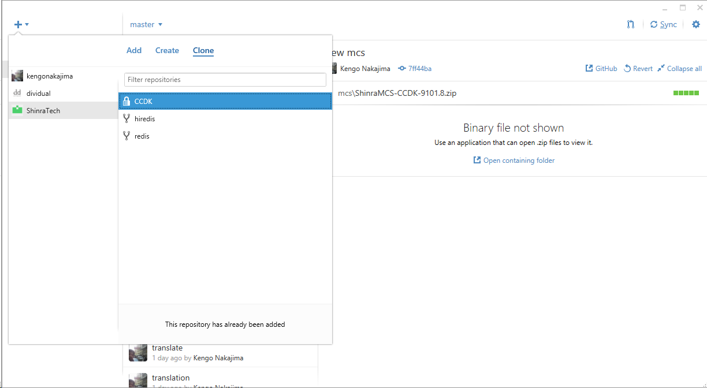

アイコンをクリックすると、CCDK, hiredis, redisのように、ShinraTechのレポジトリの一覧が表示されるので、CCDKを選択します。これでcloneが実行され、数分以内にダウンロードが完了するはずです。

ダウンロードされたレポジトリは、デフォルトでは、ユーザー名がcloudの場合、
以下の位置に配置されます。このデフォルト位置は、GitHub for Windows
のバージョンによって頻繁に変わるので、歯車アイコンから設定を開いて確認してみてください。

<pre>
C:¥Users¥cloud¥Documents¥GitHub¥CCDK
</pre>

###3. RubyやPythonなどの必要な外部ツールをインストールする。
CCDKは、以下の外部ツールを利用しています。

* Windows
  * Python 3.4 (3.4.1)
  * Ruby 2.1 (2.1.5p273)
  * VisualStudio 2013
  
* Linux
  * Ubuntu 10.04
  * Ruby 2.0.0p247 
  * g++ 4.4.3
    

それぞれ、バージョン番号の末尾の番号(マイナーバージョン)が一致していなくても動作するはずですが、開発チームでテストしているのは以上のバージョンのみです。
もし、動かなかったり、どうしてもほかのバージョンで検証する必要がある場合は、
開発チームのメンバーにご相談ください。

Python 3.4は、以下のURLのものをご利用ください。 
<pre>
https://www.python.org/downloads/windows/
</pre>
python.exeは、通常、以下のパスにインストールされます。環境変数PATHに追加しておいてください。
<pre>
C:¥python34¥python.exe
</pre>
cmd.exeなどを起動して、 pythonとタイプして以下のように表示されたら成功です。
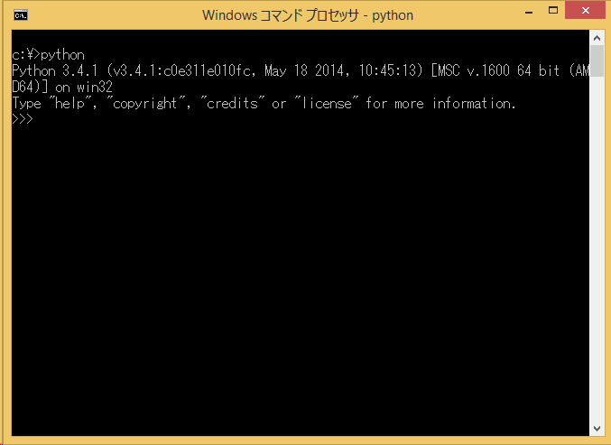

Ruby 2.1は、以下からインストーラーをダウンロードできます。
<pre>
http://rubyinstaller.org/downloads/
</pre>
ruby.exeは、通常、以下のパスにインストールされます。環境変数PATHに追加しておいてください。

<pre>
C:¥ruby21-x64¥bin¥ruby.exe
</pre>
rubyについてもPythonと同様にコマンドラインでrubyとタイプして、
プロンプトが表示されたらインストール成功です。

VisualStudio 2013については、無償版でも構いません。
CCDKの開発では、　Professional 2013を利用しています。

無償版のダウンロードは、以下のマイクロソフト社のサイトが利用できます。
<pre>
https://www.visualstudio.com/downloads/
</pre>

###4. CCDKのサンプルプログラムの動作確認を行う。

1台のWindowsマシンだけで動作確認ができるプログラムは、以下のものがあります。

1. 1:1スケルトンプログラム(Windows)
2. N:Nスケルトンプログラム(Windows)
3. バックエンドサーバープログラム

CCDK全体の動作確認は、大きく2つの段階に分けられます。
まず最初にビデオストリーミングを使わないテストを行い、
その動作確認ができたら、次にビデオストリーミングを使って同じプログラムをテストします。

また、バックエンドサーバーは、N:Nスケルトンプログラムを使って動作確認しますが、
Windows版と、UNIX版(LinuxまたはOS X)があります。
Linux版を用いたテストは後述します。

したがって、全体の手順としては以下のような流れになります。

1. 全体をビルドする。
2. 1:1スケルトンをビデオストリーミング無しで確認
3. N:Nスケルトンをビデオストリーミング無しで確認
4. 1:1スケルトンをビデオストリーミングありで確認
5. N:Nスケルトンをビデオストリーミングありで確認

<B>手順1, まず全体をビルドします。</B>

CCDKレポジトリのトップレベルに、CCDK.slnがあるのでそれを開きます(図)。

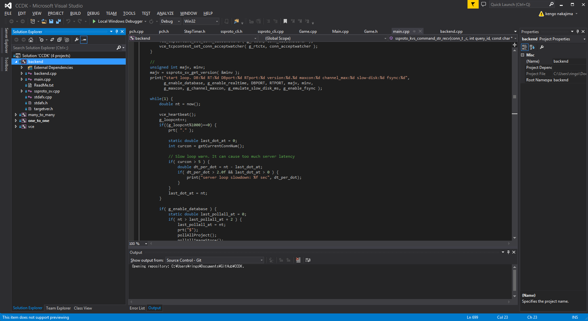

単純に「ビルド」を実行すると全体がコンパイルされます。
その際、DirectX ToolKitというパッケージがNuGetにより、自動的に復元(インストール)されます。

<B>手順2, 1:1スケルトンをビデオストリーミング無しで確認。</B>

試しに、one_to_oneをスタートアッププロジェクトに設定して、デバッグ実行を開始してください。

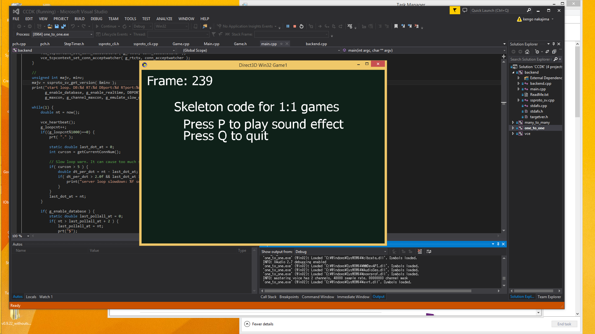

上の図のように、フレームカウンタが増加しつづけているウインドウが表示されたら成功です。
ウインドウを閉じるか、Qキーを押すと終了します。

<B>手順3, N:Nスケルトンをビデオストリーミング無しで確認。</B>

バックエンドサーバーを起動せずに many_to_manyを起動してみます。

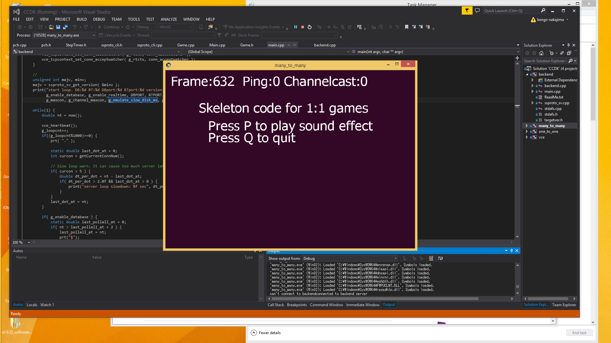

one_to_oneに比べると、 "Ping:0"と"Channelcast:0"が増えています。
Ping:0は、バックエンドサーバーに対するPingが返ってきた回数が0回、
つまり接続できていないことを示します。 Channelcast:0も同様です。

プログラムを一旦終了して、次にバックエンドサーバーを起動します。
今はデバッグをするのが目的ではないので、デバッガ無しでbackendプロジェクトを起動します。
バックエンドサーバーのデータベース機能を有効にする場合はRedisサーバも起動する必要がありますが、CCDK.slnのデフォルトの状態ではデータベース機能は使わないように設定してあります。
Redisを使う場合については後述します。

バックエンドサーバーが起動すると、以下の図のようにコンソールが表示されてログが出力されます。
このログはVisualStudioのデバッグ出力にもコピーされます。
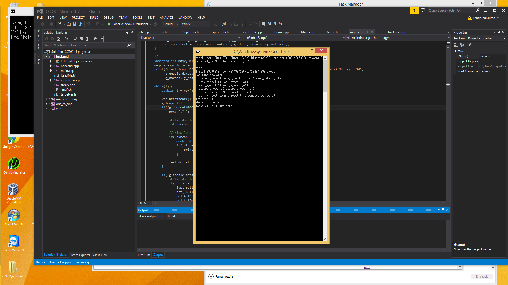

デバッガ付きで起動したい場合は、VisualStudioのインスタンスを増やしてください。

さらに many_to_manyプロジェクトをデバッガ無しでひとつ起動すると以下の図のようになります。
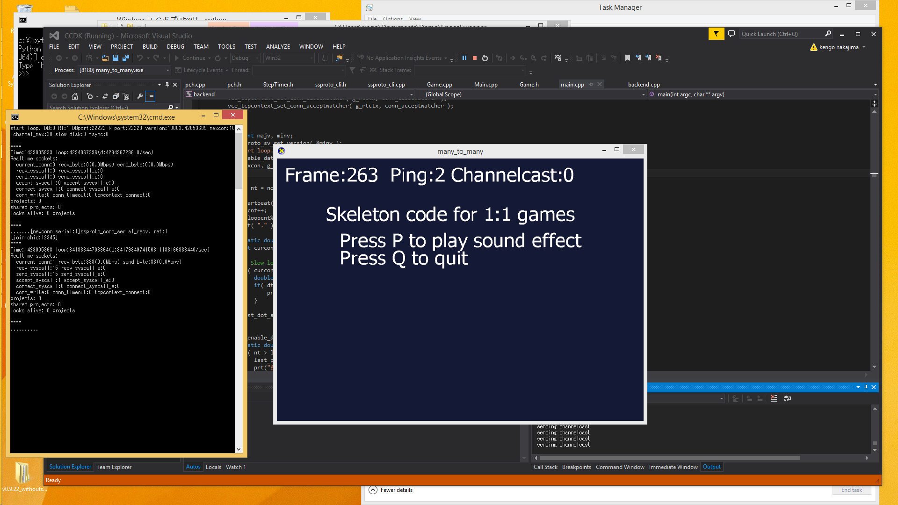

Pingカウンタの値が増えていきます。バックエンドサーバーとの通信が成功していることがわかります。ただし、Channelcastは0のままです。これは、Channelcastが自分自身には送信しないためです。

さらにもうひとつmany_to_manyを起動します。

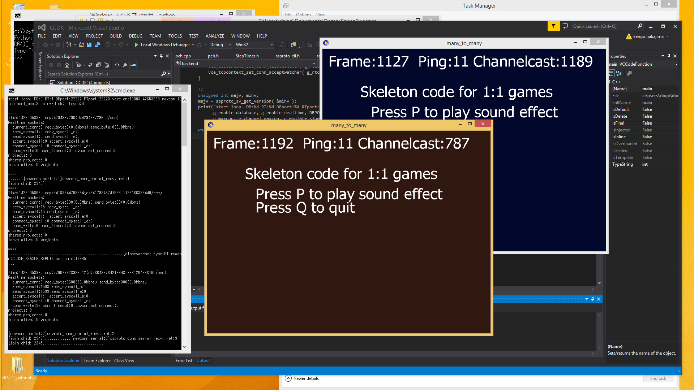

すると、今度はChannelcastの値が毎フレーム1づつ増えていくことがわかります。
現状のmany_to_manyプログラムは、チャネル(ID=12345)に対して、
毎フレーム1個づつのchannelcastパケットを送信します。
バックエンドに接続しているプログラムが増えれば増えるほど、
その数の2乗に比例した数のchannelcastパケットを受信します。
many_to_manyを、さらにいくつか起動して、パケットの受信速度を見てみてください。

<B>手順4, 1:1スケルトンをビデオストリーミングありで確認</B>

ビデオストリーミングを試すには、CCDK/mcsディレクトリに配置されている、
MCSのパッケージが必要です。 MCSパッケージを展開する位置はどこでもかまいません。
ここではCCDK内に置かれた位置でそのまま展開します(図)。
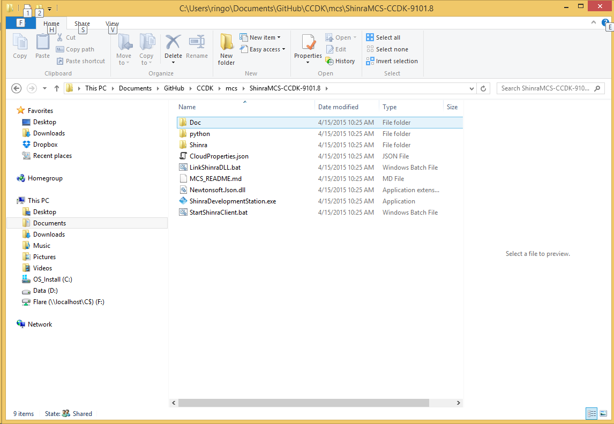

図の9101.8という番号はMCSのビルド番号で、新しいバージョンがリリースされるたびに変わります。

展開ができたらShinraDevelopmentStation.exeを実行します。
署名をしていないプログラムを実行する際のWindowsの警告が表示されますが、実行を選択してください。このプログラムを以降では"SDS"と呼びます。

SDSは内部でPythonを使うため、Pythonのセットアップが必要です。

実行すると以下のように空のウインドウが表示されます。
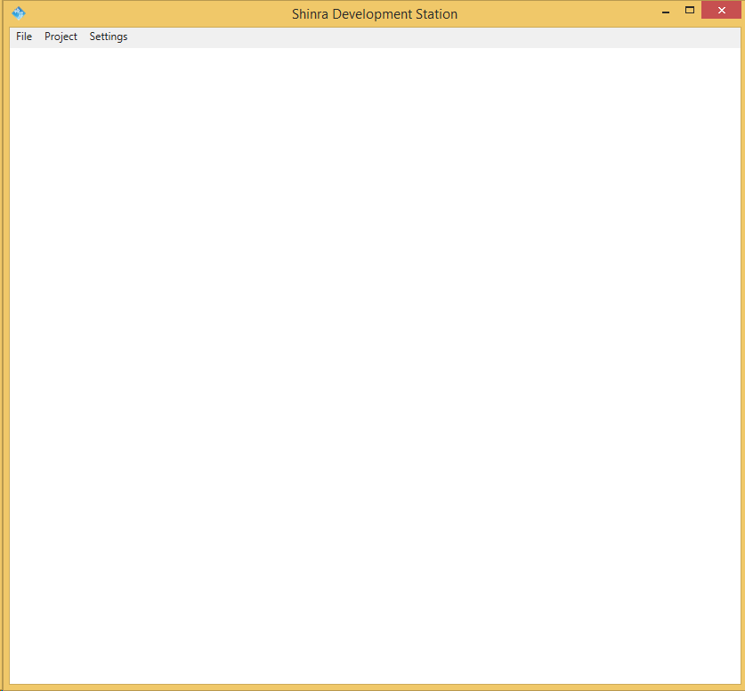

SDSはゲームプログラムのパッケージを作ったり使うためのGUIツールです。別のドキュメントで詳しく説明します。
ここではメニューの <code>File > New</code> を選択します。 
New Shinra Project というウインドウが表示されるので、
プロジェクトの設定を保存するためのファイル(.vcxprojのようなもの)の名前を入力してください。
仮にsdstestなどとします。 
ファイルを保存する位置は、Documentsフォルダなどを適当に指定してかまいません。
次にメニューの <code>Project > Add Data pack</code>を選択します。
すると以下のようなウインドウが表示されます。
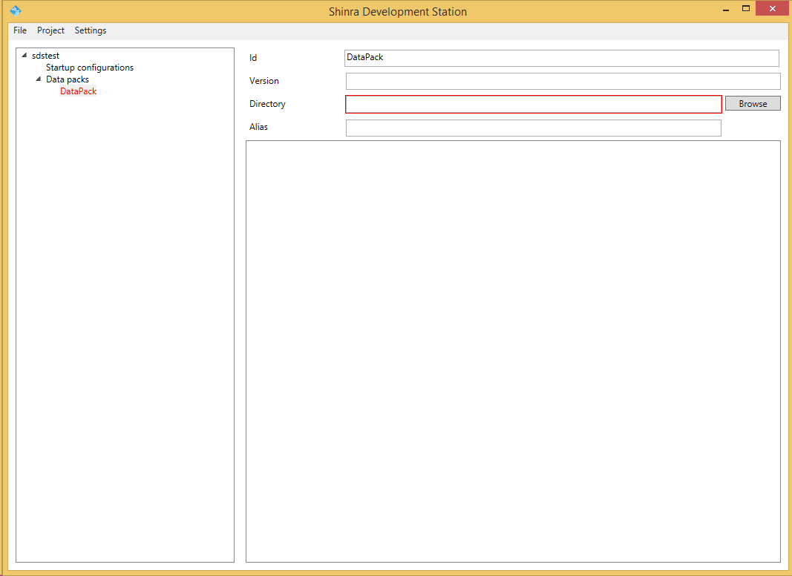
DataPackは、ゲームの実行に必要なファイルがすべて格納されているディレクトリです。

SDSを手早く試せるようにするため、CCDKレポジトリのトップレベルに、<code>CCDK/streamtest</code>というディレクトリがあります。ここに、one_to_one.exeとmany_to_many.exeと、必要な画像ファイルなどが配置されています(図)。
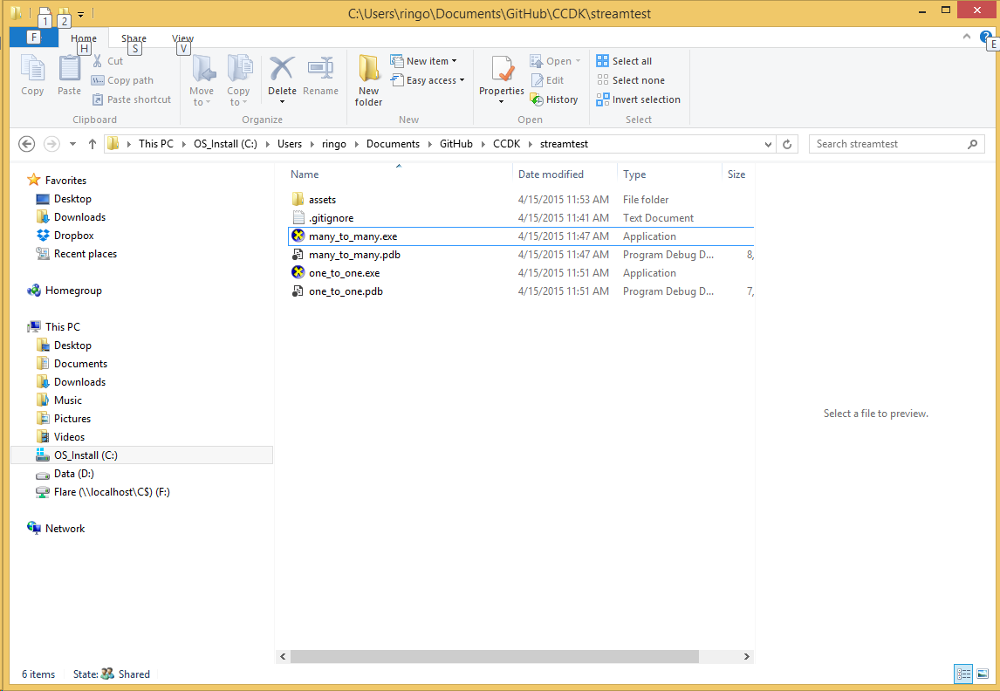
念のためここで one_to_one.exeなどをダブルクリックして起動し、動作確認してください。

このディレクトリをDataPackとして、そのまま追加します。
メニューから<code>Project > Add Data Pack</code>を選択して、
Browseボタンを押し、 streamtestディレクトリを選択し、成功すると以下のように、左側のツリービューに <code> sdstest > Data packs > DataPack </code> と表示されます。
DataPackは複数追加できますが、今はひとつだけとします。

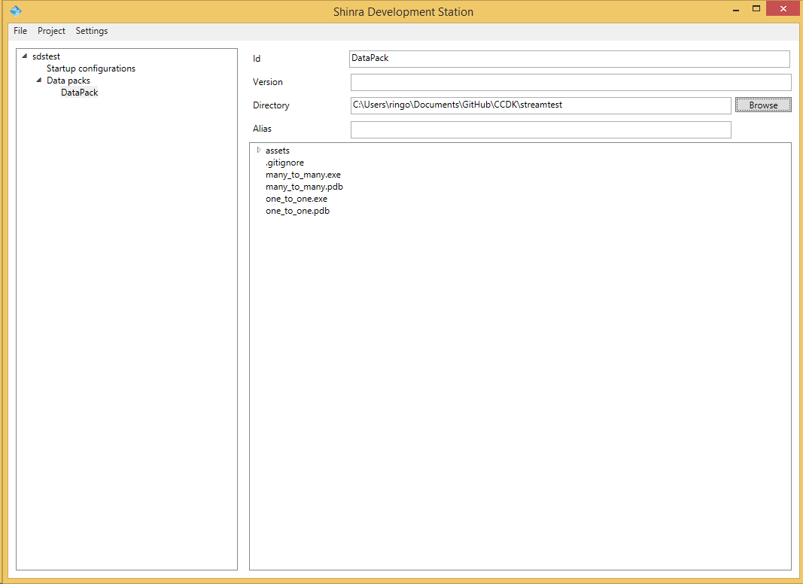

次に,Startupという項目で、このDataPackの中のどのファイルが起動すべき実行ファイルなのかを指示します。
<code>Project > Add Startup configuration</code>を選択すると次のような画面が表示されます。
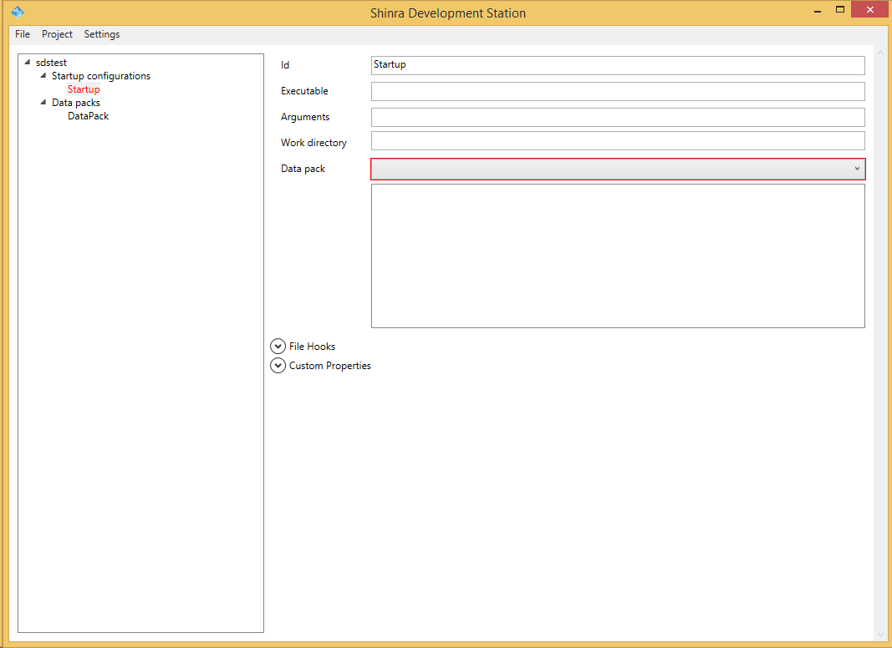

Data packの項目が赤い枠になっていますが、これはDataPackがまだ選択されていないことを示しています。　赤い枠をクリックしてすでに追加されているDataPackを選択します。

次に Executableの入力欄に、 one_to_one.exeと直接入力します。赤い枠が消えたら、入力完了です。

Executableの次は、Work directoryを指定します。DataPackの中のトップディレクトリで動作させたいので、 "." (ダブルクォート記号は含まない)を指定します。

最後に動作確認を行います。<code>Project > Start game > Startup </code>を選択します。

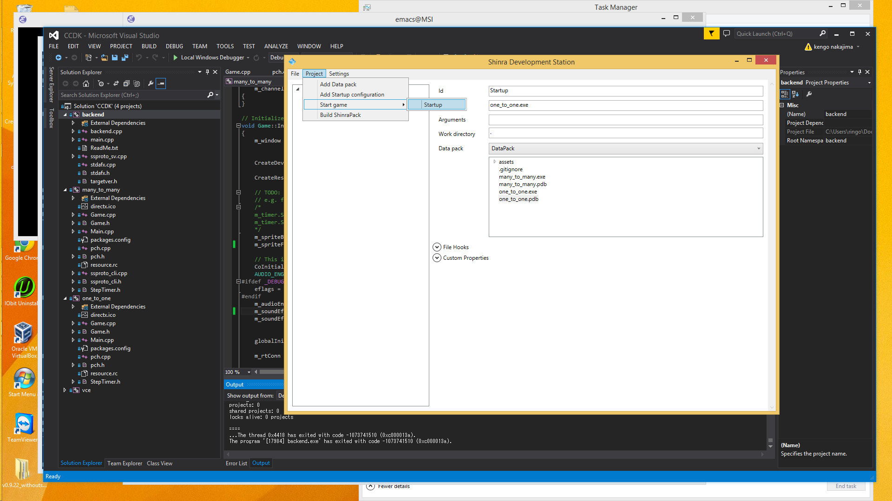

Startupを選択すると以下のような Start ボタンが表示されます。

ユーザー名や使われるポート番号などの情報が表示されていますが、それらは別のドキュメントで説明します。ここではStartボタンを押します。

ウインドウが2つ表示されます(初回実行時は、Windowsの警告が表示されますが、つねに許可を選択してください。) ひとつは、 "Direct3D Win32 Game1" で、これは、one_to_one.exeのウインドウです。もうひとつは ShinraClient で、これがビデオストリームのビューワです。

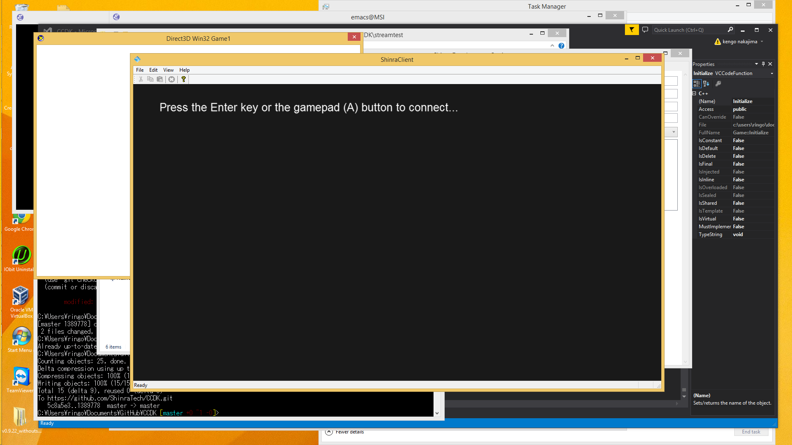

ShinraClientにフォーカスしてEnterを押すと、以下のようにビデオストリームが見えます。
ビデオストリームを介さない描画と画質が違っているのがわかります。また、Pキーを押してサウンドを再生した際、タイミングが若干遅れているのもわかります。　映像と音声のクオリティや遅延については、シンラ・システムの商用サービスと異なっていることに注意してください。
one_to_one.exeのウインドウは、画面に対しては描画していないので、真っ白のままになります。

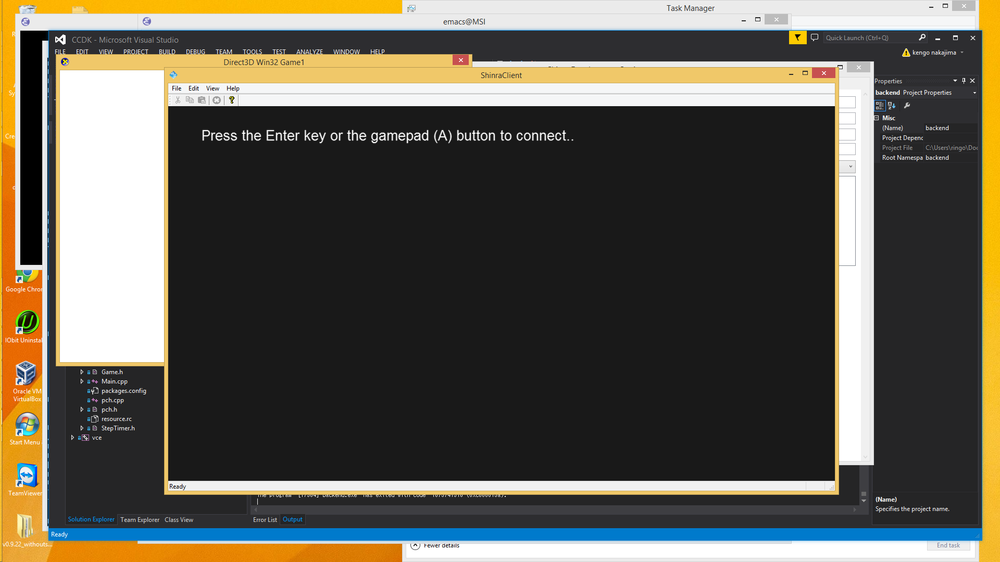

ShinraClientを閉じ、 SDSのStopボタンを押してテストを終了します。

<B>手順5, N:Nスケルトンをビデオストリーミングありで確認</B>

手順4でDataPackとして指定した CCDK/streamtestというディレクトリには、
many_to_many.exeも含まれています。SDSを用いて、Startupをもうひとつ追加するだけで、
many_to_manyのビデオストリームを試すことができます。

まず、手順3の方法で、CCDK.slnからバックエンドサーバーを起動してください。
これはデバッガあり・なしどちらでもかまいません。

次に、SDSで<code>Project > Add Startup configuration</code>を選択し、Data packとしてDataPackを、Executableとして many_to_many.exeを追加し, Work directoryも手順4と同様"."を指定します(図)。
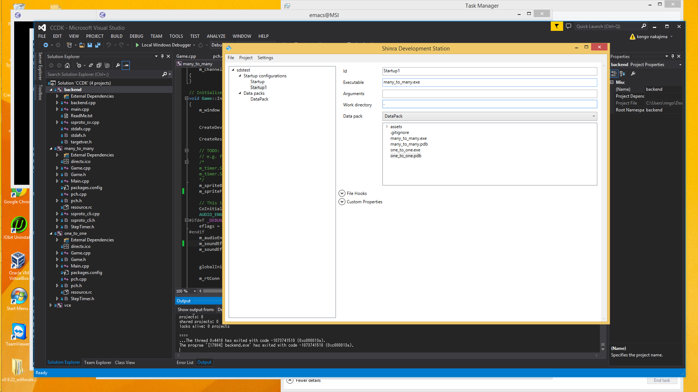

このとき新しいStartup1というStartup configurationが追加されているのが、左側のツリービューでわかります。

追加できたら <code>Project > Start game  > Startup1</code>を選択して、手順4と同様に起動します。ビデオストリームが表示され、Pingの値が増加していけば成功です(図)。

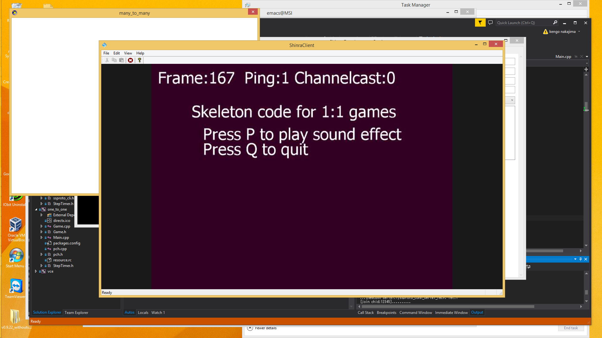

複数のmany_to_many.exeを起動するには、Startボタンが表示されているウインドウの灰色の部分で右クリックをしてポップアップメニューを表示し、<code>Add game instance</code>を選択します(図).
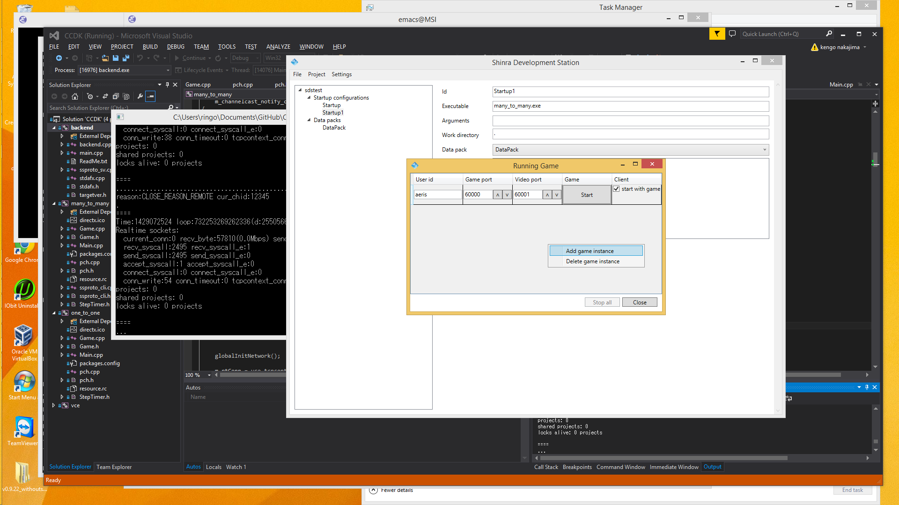

すると以下の図のように、異なるポート番号が割り当てられた2つのゲームを起動することができるようになります。

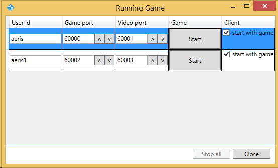

それぞれのStartボタンを押して2組の many_to_many.exeと ShinraClientを起動します(図)。

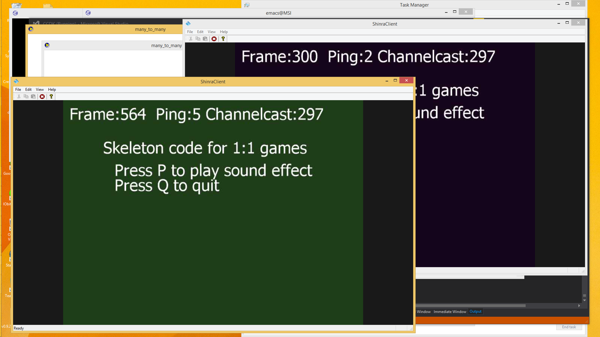

Channelcastのカウンタ値が増えていくのが見えたら完了です。
同じ要領で、クライアントをいくつでも追加することができます。

